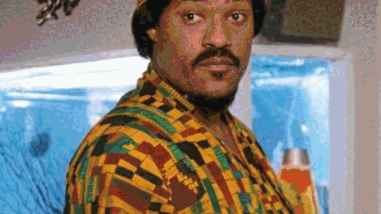

 

 

I build things, I also write/draw/shoot photos/try to make music/skateboard/sip various flavors of lemonade/and dance on occasion. Dallas-based dev currently deep in the Next.js + Supabase trenches (with the occasional detour into Vue, Svelte, and whatever framework looked fun that week).

I wanted to make a portfolio site, and figured it'd be kinda boring if I only put coding projects on it - so [tunjiproductions.com](https://tunjiproductions.com/) became more of a home base for everything me: personal projects, requests, music, articles, all of it. I try to put a **lil smidgin of my soul** into everything I make, and now that I'm confident as a developer, I might as well showcase the work. ✨

 

## 🛠️ what I'm building

<table>
<tr>
<td width="50%" valign="top">

### 🎧 [TwoTone](https://github.com/Guysnacho/twotone)
A social music app born from sending way too many "song of the day" texts to friends. Started life as a Sveltekit experiment, now living the Expo + Next.js monorepo life.
**→ [twotone.app](https://twotone.app)**

</td>
<td width="50%" valign="top">

### 🎓 [MCBIOS](https://github.com/Guysnacho/mcbios)
Conference site + membership portal for a bioinformatics research society - Next.js, Supabase, Stripe, and a *lot* of forms.

</td>
</tr>
<tr>
<td width="50%" valign="top">

### 🗂️ [Conference Suite](https://conferencesuite.net)
Multi-tenant platform for running academic conferences end to end, born from the lessons learned shipping MCBIOS.

</td>
<td width="50%" valign="top">

### 🚗 [De Prestige](https://github.com/Guysnacho/prestige)
Luxury chauffeur booking platform with real-time trip tracking for riders, drivers, and admins - Next.js, Supabase, Stripe, MapLibre.

</td>
</tr>
<tr>
<td width="50%" valign="top">

### ☁️ [SSG meets S3](https://github.com/Guysnacho/ssg-s3)
My "let me actually learn Terraform and AWS" project - statically generates a site and ships it straight to S3 + CloudFront via GitHub Actions. Sip water. 💧

</td>
<td width="50%" valign="top">

### 🌐 [tunjiprod](https://github.com/Guysnacho/tunjiprod)
The portfolio site itself, now on rewrite #2 - full circle back to Vue, by way of Nuxt. [Read the journey on the blog →](https://tunjiproductions.com/blog)

</td>
</tr>
</table>

 

## 🧰 tech I reach for

 

## 🎨 beyond the code

When I'm not shipping I'm probably hunting for new music (peep [TwoTone](https://twotone.app) for the proof), catching a show, getting back into drawing, shooting photos, rolling around on a skateboard, sipping on some lemonade, or writing it all up on the [blog](https://tunjiproductions.com/blog).

 

  

  

a lil slideshow of a few images that build my personal philosophy, no other context provided
 

 

<i>peace nd love ~</i>

